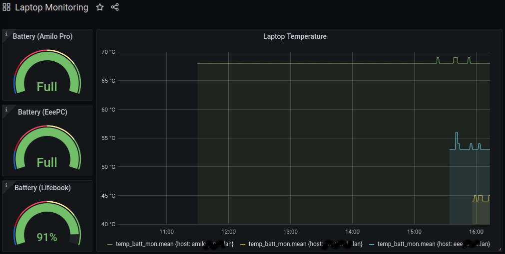

# laptop-temp-batt

A simple bash script to log the current temperature and battery charge of a laptop, for telemetry. Not sophisticated in its interrogation of /sys/class at the moment.

I'm parsing the results with Telegraf, for InfluxDB, and displaying them in a Grafana dashboard (see below).

I also want to look at alerting on trip types (in Grafana directly, I think).

